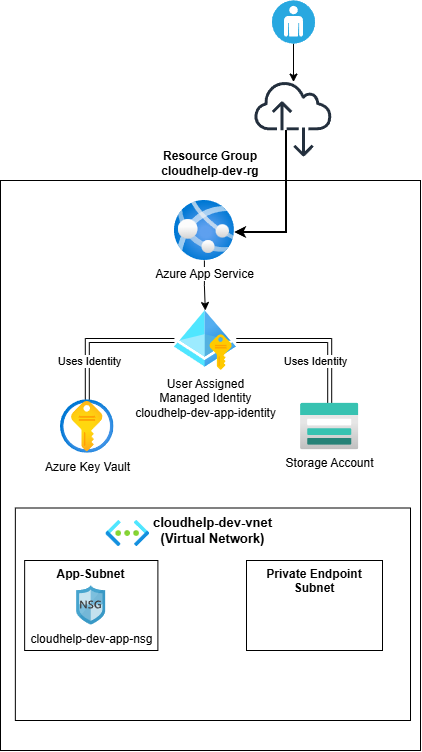

## Contents
- Purpose
- High-Level Architecture
- Azure Resource Groups
- Networking
- Application Hosting
- Storage
- Identity and Security
- Monitoring and Alerting
- Terraform State
- CI/CD Architecture
- Resource Relationships
- Current Limitations
- Future Enhancements

---

# CloudHelp Architecture

**Version:** 1.0  
**Platform:** CloudHelp Development Environment  
**Infrastructure:** Microsoft Azure  
**Provisioning:** Terraform  
**Last Updated:** August 2026

## Purpose

This document describes the architecture of the CloudHelp Azure platform and explains the design decisions behind each component. The platform has been developed incrementally using Infrastructure as Code (IaC) with Terraform and follows Azure architecture, security and DevOps best practices.

The document provides an overview of the platform's networking, identity, application hosting, storage, monitoring and deployment architecture, and explains how these components work together to form the current CloudHelp development environment.



*Current architecture as of CloudHelp Platform v1.0.*

---

## High-Level Architecture

The CloudHelp platform is built around a secure Infrastructure as Code workflow that automates the provisioning, monitoring and management of Azure resources.

Infrastructure changes are developed using feature branches, validated through GitHub Actions and deployed to Azure using Terraform. Authentication is performed using OpenID Connect (OIDC) federation with Microsoft Entra ID, eliminating the need for stored credentials.

The deployed platform consists of networking, application hosting, storage, identity, monitoring and operational components that work together to provide a secure foundation for future application development.

```text
Developer
      │
Feature Branch
      │
GitHub Actions
      │
OIDC Authentication
      │
Terraform
      │
Azure Development Environment
```

---

## Azure Resource Groups

The CloudHelp platform uses two dedicated Azure Resource Groups to separate application infrastructure from Terraform backend resources.

### cloudhelp-dev-rg

The `cloudhelp-dev-rg` Resource Group contains the application infrastructure, including networking, storage, identity, compute and monitoring resources. Keeping these resources together simplifies deployment, management and lifecycle operations while providing a clear separation between the application platform and supporting infrastructure.

### cloudhelp-tfstate-rg

The `cloudhelp-tfstate-rg` Resource Group hosts the Azure Storage Account used for the remote Terraform backend. Separating the Terraform state infrastructure from the application environment protects the state file from accidental deletion when application resources are modified or removed, and reflects a common production practice.

As the platform evolves, additional environments such as Test and Production would each use their own dedicated Resource Groups while continuing to use separate Terraform backend infrastructure where appropriate.

---

## Networking

The CloudHelp platform uses a dedicated Azure Virtual Network (VNet) to provide logical network isolation for application resources. The network has been designed with future growth in mind, allowing additional services and private connectivity to be introduced without requiring significant architectural changes.

The Virtual Network currently contains two subnets:

### App Subnet

The **App Subnet** is intended for application-related networking. A Network Security Group (NSG) is associated with the subnet to provide network-level traffic filtering and establish a foundation for controlling inbound and outbound connectivity as the platform evolves.

### Private Endpoint Subnet

The **Private Endpoint Subnet** has been reserved for future Private Endpoints, enabling Azure services such as Key Vault and Storage Accounts to communicate over private IP addresses instead of public endpoints. Reserving a dedicated subnet aligns with Azure networking best practices and simplifies future expansion of the platform.

Separating application resources from private networking infrastructure improves network organisation, allows different security controls to be applied to each workload, and reduces the complexity of future network changes.

### Current Implementation

At the current stage of the project:

- The Linux App Service has not yet been integrated with the Virtual Network.
- Private Endpoints have not yet been deployed.
- Public network access remains enabled for development purposes.

---

## Identity and Security

Security is a core design principle of the CloudHelp platform. Authentication and authorisation are implemented using Microsoft Entra ID, Azure Role-Based Access Control (RBAC), Managed Identities and Azure Key Vault to minimise the use of credentials while following the principle of least privilege.

### User Assigned Managed Identity

The Linux App Service uses a User Assigned Managed Identity to authenticate securely with Azure services. Rather than storing client secrets or credentials within the application, Azure provides an identity that can be granted access to specific resources through Azure RBAC.

Using a Managed Identity reduces the risk of credential exposure, removes the need for manual credential rotation and follows Microsoft's recommended approach for authenticating Azure applications.

The Managed Identity currently has the **Key Vault Secrets User** role, allowing the application to retrieve secrets securely without requiring embedded credentials. Additional permissions can be granted in the future as the platform evolves.

### Azure Key Vault

Azure Key Vault provides secure storage for application secrets and sensitive configuration values. Instead of storing secrets within application code, configuration files or source control, sensitive information is stored centrally and accessed securely using the application's Managed Identity.

The Key Vault is configured to use Azure RBAC rather than legacy access policies, providing a consistent authorisation model across the Azure environment.

### GitHub OIDC Authentication

The CloudHelp CI/CD pipeline authenticates to Azure using OpenID Connect (OIDC) federation. This enables GitHub Actions to obtain short-lived Azure access tokens without storing client secrets within the repository.

Separate Microsoft Entra applications are used for the Terraform planning and deployment workflows. The planning identity is granted read-only access where possible, while the deployment identity has the permissions required to create, modify and remove Azure resources.

This passwordless authentication model follows Azure security best practices and reduces the operational overhead associated with managing long-lived credentials.

---

## Application Hosting

The CloudHelp platform uses Azure App Service to provide a managed hosting environment for web applications. The current implementation establishes the application hosting foundation and demonstrates how compute resources integrate with the wider Azure platform.

### Linux App Service

The application is hosted using an Azure Linux App Service. App Service was selected because it provides a fully managed Platform as a Service (PaaS) environment, allowing applications to be deployed without managing the underlying operating system or virtual machines.

The App Service is configured to use a User Assigned Managed Identity, enabling secure authentication to Azure resources such as Key Vault without requiring embedded credentials.

### App Service Plan

The App Service Plan provides the compute resources required to host the Linux App Service. Separating the hosting plan from the application allows multiple applications to share the same compute resources in the future while simplifying capacity management and scaling.

### Current Implementation

At the current stage of the project:

- The App Service hosts a placeholder application used to validate the deployment platform.
- The App Service has not yet been integrated with the Virtual Network.
- Application configuration and secrets are intended to be retrieved from Azure Key Vault using the Managed Identity.
- Future development will expand the platform to support a production-style application workload together with additional Azure integrations.

---

## Storage

The CloudHelp platform uses Azure Storage for two distinct purposes: application data storage and Terraform remote state management. Separating these responsibilities improves security, simplifies management and follows common Infrastructure as Code best practices.

### Application Storage

The application Storage Account provides durable object storage for the CloudHelp platform. Blob Storage is intended to store user-uploaded files, application-generated content and other unstructured data.

Separating storage from compute allows each service to scale independently while maintaining a loosely coupled architecture. The storage account is configured independently of the App Service, allowing storage capacity and application compute resources to be managed separately as the platform evolves.

The application currently uses a private Blob Container named `customer-files` to demonstrate secure object storage within the platform.

### Terraform Backend Storage

A separate Storage Account is used to host the remote Terraform state file. Storing Terraform state remotely enables multiple users and automation workflows to work against a shared source of truth while preventing state files from being stored locally.

The backend Storage Account is hosted within a dedicated Resource Group and uses Microsoft Entra authentication rather than storage account access keys. Terraform state locking is provided through Azure Blob Storage leases, preventing concurrent infrastructure changes from multiple Terraform executions.

### Design Decisions

Separating application storage from Terraform backend storage provides several advantages:

- Application data and infrastructure state remain isolated.
- Terraform state is protected from accidental deletion alongside application resources.
- Multiple users and GitHub Actions workflows can safely manage the same infrastructure.
- Storage resources can be scaled and managed independently based on their individual requirements.

---

## Monitoring and Alerting

The CloudHelp platform uses Azure Monitor and Azure Log Analytics to provide operational visibility across the Azure environment. Diagnostic data from key platform resources is centralised within a Log Analytics Workspace, where it can be queried using Kusto Query Language (KQL), visualised through Azure Monitor and used to trigger automated alerts.

### Log Analytics Workspace

A dedicated Log Analytics Workspace collects diagnostic logs and metrics from Azure resources. Centralising platform telemetry provides a single location for operational monitoring, troubleshooting and alerting while supporting future dashboarding and reporting.

### Diagnostic Settings

Azure Diagnostic Settings have been configured for key platform resources to forward logs and metrics to the Log Analytics Workspace.

The current implementation includes:

- Azure Key Vault
- Linux App Service
- App Service Plan
- Azure Storage Blob Service

This configuration provides visibility into authentication events, application requests, platform metrics and storage operations.

### Azure Monitor Alerts

Azure Monitor provides both metric-based and log query-based alerting across the platform. The platform currently includes the following alert rules:

- HTTP 5xx responses from the Linux App Service
- High CPU utilisation on the App Service Plan
- High memory utilisation on the App Service Plan
- Failed Key Vault requests detected using Kusto Query Language (KQL)

Metric alerts are used where Azure provides native platform metrics, while scheduled query alerts are used for events captured within Log Analytics.

### Action Group

All alert rules share a common Azure Monitor Action Group that provides email notifications when an alert is triggered. Using a shared Action Group simplifies alert management and provides a consistent notification mechanism across the platform.

### Validation

The monitoring platform has been validated by generating a failed Key Vault request and confirming the complete monitoring workflow:

- Azure Diagnostic Settings captured the event.
- The event was ingested into the Log Analytics Workspace.
- The scheduled KQL alert detected the failure.
- Azure Monitor triggered the alert rule.
- The Action Group successfully delivered an email notification.

This end-to-end validation demonstrates that the monitoring and alerting pipeline is functioning as designed.

---

## Terraform State

The CloudHelp platform uses a remote Terraform backend hosted in Azure Storage to maintain the infrastructure state. Moving the state file from local storage to Azure provides a shared source of truth for both developers and automation workflows while improving security and collaboration.

### Remote Backend

The Terraform state file is stored in a dedicated Azure Storage Account located within the `cloudhelp-tfstate-rg` Resource Group. Separating the backend infrastructure from the application environment protects the state file from accidental deletion and allows the Terraform backend to be managed independently of the platform resources.

### Microsoft Entra Authentication

Terraform authenticates to the remote backend using Microsoft Entra ID rather than Storage Account access keys. This passwordless authentication model improves security by eliminating long-lived credentials and allows access to be controlled through Azure Role-Based Access Control (RBAC).

GitHub Actions also authenticates using OpenID Connect (OIDC), allowing both local development and CI/CD pipelines to securely access the same remote backend without storing secrets within the repository.

### State Locking

State locking is provided through Azure Blob Storage leases. Before Terraform performs an operation, it acquires an exclusive lock on the state file to prevent multiple users or automation workflows from modifying the infrastructure simultaneously.

This ensures that infrastructure changes are applied safely and prevents state corruption caused by concurrent Terraform executions.

### Bootstrap Process

The remote backend infrastructure cannot store its own Terraform state until it already exists. For this reason, the backend Storage Account and Blob Container are created using a separate bootstrap configuration before the main platform is deployed.

Once the backend has been created, the main CloudHelp platform is configured to use the remote backend for all subsequent Terraform operations.

---

## CI/CD Architecture

The CloudHelp platform uses GitHub Actions to automate the validation and deployment of Terraform infrastructure. The CI/CD pipeline is designed to follow modern DevOps practices by validating infrastructure changes before deployment, enforcing code reviews and using passwordless authentication to Azure.

### Continuous Integration

The Continuous Integration (CI) workflow is triggered for every pull request targeting the `main` branch. Its purpose is to validate infrastructure changes before they are merged into the primary codebase.

The workflow performs the following tasks:

- Checks out the repository
- Authenticates to Azure using OpenID Connect (OIDC)
- Initialises the Terraform backend
- Validates Terraform formatting
- Validates the Terraform configuration
- Generates a Terraform execution plan

The generated Terraform plan allows infrastructure changes to be reviewed before deployment while ensuring invalid configurations cannot be merged into the main branch.

### Continuous Deployment

The Continuous Deployment (CD) workflow is triggered manually using GitHub Actions after infrastructure changes have been reviewed and merged.

The deployment workflow:

- Authenticates to Azure using OpenID Connect (OIDC)
- Downloads the approved Terraform execution plan
- Waits for manual approval through a protected GitHub Environment
- Applies the approved Terraform plan to Azure

Separating the planning and deployment stages ensures that infrastructure changes are reviewed before they are applied while providing an approval gate for production-style change management.

### Authentication

GitHub Actions workflows authenticate to Azure using OpenID Connect (OIDC) federation with Microsoft Entra ID. This removes the need to store client secrets within GitHub and allows Azure to issue short-lived access tokens to the workflow at runtime.

Separate Microsoft Entra applications are used for the planning and deployment workflows. The planning identity is granted read-only permissions wherever possible, while the deployment identity has the permissions required to create, modify and remove Azure resources.

### Branch Protection

The `main` branch is protected using GitHub Branch Protection Rules.

Infrastructure changes must:

- Be developed on a feature branch.
- Be submitted through a Pull Request.
- Pass the Terraform validation workflow.
- Be reviewed before merging into the `main` branch.

These controls help prevent unreviewed infrastructure changes from being introduced into the platform.

### Design Decisions

Several architectural decisions were made when implementing the CI/CD pipeline:

- Infrastructure validation and deployment are separated into independent workflows.
- Passwordless authentication is used throughout the platform.
- Remote Terraform state ensures a single source of truth for infrastructure.
- Environment approvals provide an additional safeguard before infrastructure changes are applied.
- Branch protection ensures that all infrastructure changes follow a consistent development workflow.

---

## Component Relationships

```text
GitHub Actions
      │
      ▼
Microsoft Entra ID (OIDC Federation)
      │
      ▼
Terraform
      │
      ▼
Azure Resource Group
      │
      ├── Virtual Network
      ├── Storage Account
      ├── Key Vault
      ├── Linux App Service
      ├── User Assigned Managed Identity
      └── Log Analytics Workspace

Azure Resources
      │
      ▼
Diagnostic Settings
      │
      ▼
Log Analytics Workspace
      │
      ▼
Azure Monitor Alerts
      │
      ▼
Action Group
      │
      ▼
Email Notifications
```

---

## Security Decisions

Security has been considered throughout the design of the CloudHelp platform. The platform follows a defence-in-depth approach by combining identity, network and infrastructure security controls to reduce risk while following Azure security best practices.

The primary security decisions include:

- Passwordless authentication using Microsoft Entra ID, OpenID Connect (OIDC) and Managed Identities.
- Azure RBAC used as the primary authorisation model across Azure resources.
- Azure Key Vault used for centralised secret management rather than embedded application credentials.
- Separate identities for Terraform planning and deployment workflows, following the principle of least privilege.
- Dedicated networking for application resources and future private connectivity.
- Network Security Groups providing network-level traffic filtering.
- Remote Terraform state protected using Microsoft Entra authentication and Azure Blob state locking.
- Branch protection, Pull Requests and manual deployment approvals to control infrastructure changes.

Together, these design decisions provide multiple layers of security across the CloudHelp platform while establishing a foundation that can be extended as additional Azure services are introduced.

---

## Current Limitations

The current implementation represents a development environment intended to demonstrate Azure and DevOps engineering practices. The platform is functional but intentionally limited in scope.

Current limitations include:

- A single Development environment.
- Public network access remains enabled for Azure resources.
- Private Endpoints have not yet been implemented.
- The App Service hosts a placeholder application rather than a production workload.
- Application Insights and Azure SQL Database have not yet been deployed.
- Terraform modules have not yet been introduced.

---

## Future Enhancements

The current implementation establishes a solid Azure platform that demonstrates Infrastructure as Code, secure deployment practices and operational monitoring. Future development will focus on expanding the platform with additional Azure services, improving security and introducing production-ready capabilities.

### Observability

- Integrate Azure Application Insights for application performance monitoring.
- Develop Azure Monitor Workbooks to provide operational dashboards and visualisations.
- Expand monitoring and alerting to cover additional Azure resources and application services.

### Security

- Deploy Private Endpoints for Azure Storage and Key Vault.
- Integrate the Linux App Service with the Virtual Network.
- Implement Microsoft Defender for Cloud recommendations and security monitoring.
- Introduce Private DNS Zones to support private networking.

### Application Platform

- Deploy Azure SQL Database for persistent application data.
- Configure application settings and secret management through Azure Key Vault.
- Expand the application hosting environment to support production-style workloads.

### Infrastructure

- Refactor the Terraform configuration into reusable modules.
- Introduce separate Development, Test and Production environments.
- Implement reusable deployment pipelines for multiple environments.

### Future Learning

As the CloudHelp platform evolves, additional technologies may be incorporated to broaden the project's scope and demonstrate further Azure and DevOps capabilities, including:

- Azure Front Door
- Containerisation
- Kubernetes
- Azure Container Apps
- Azure API Management

---
The CloudHelp platform will continue to evolve as additional Azure services and DevOps practices are implemented. Each enhancement will follow the same Infrastructure as Code, security and operational principles established throughout the current platform architecture. 
---